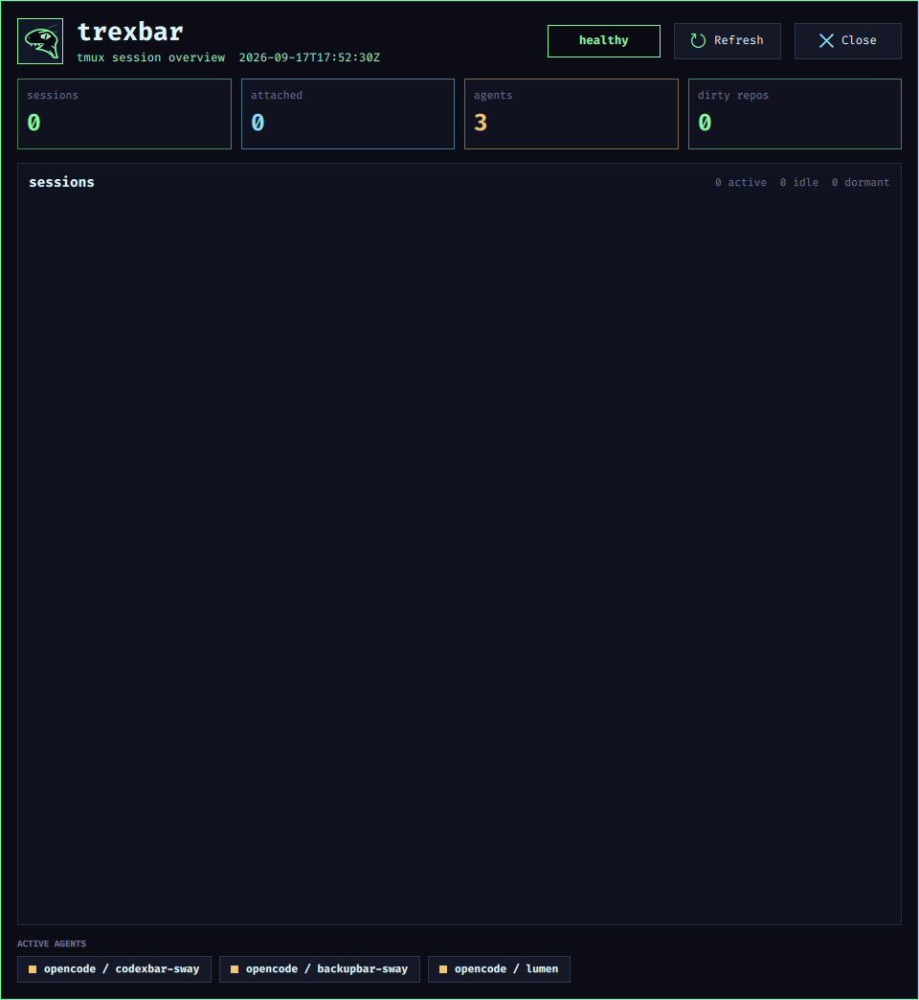

# trexbar-sway

<p align="center">
  
</p>

`trexbar-sway` is a read-only Sway/Waybar companion for `trex`. It uses `trex snapshot --json` as the backend contract, caches runtime state in Ruby, renders a compact Waybar chip, and opens a focused QuickShell modal.



V1 does not attach, switch, create, delete, or detach tmux sessions.

## Dependency

`trexbar-sway` depends on a `trex` binary that supports:

```bash
trex snapshot --json
```

Set `runtime.trexCommand` in `~/.config/trexbar-sway/config.json` when `trex` is not on `PATH`.

## Commands

```bash
trexbar-sway config init
trexbar-sway config validate
trexbar-sway refresh --format json --pretty
trexbar-sway daemon
trexbar-sway daemon --once
trexbar-sway snapshot
trexbar-sway ui toggle
trexbar-sway waybar render
trexbar-sway waybar refresh
trexbar-sway waybar panel
trexbar-sway omarchy install
trexbar-sway omarchy remove
trexbar-sway omarchy status
trexbar-sway panel
```

Use `make check-trex` to verify the backend dependency from this checkout.

## Desktop Autostart

`trexbar-sway` has two separate runtime pieces:

- `trexbar-sway daemon --config ~/.config/trexbar-sway/config.json` refreshes `trex snapshot --json`, tmux, process, git, gemini, and resource state, then writes `snapshot.json`.
- `trexbar-sway waybar render --config ~/.config/trexbar-sway/config.json` reads that cached snapshot and returns Waybar JSON.

Waybar does not poll `trex`, tmux, `/proc`, or git by itself. If the daemon is not running after login or reboot, the Waybar chip can keep rendering, but it will render stale cached state. A desktop integration should therefore start and supervise the daemon at session startup.

On SolverForge Linux, the managed Waybar integration starts companion daemons through `solverforge-waybar-companions-start`, launched from Sway `exec_always` beside Waybar. That launcher restarts `trexbar-sway daemon` if an early boot-time refresh failure makes it exit.

## Hyprland + Omarchy

On a Hyprland desktop running the Omarchy shell, the same Waybar chip mounts as a bar command module:

```bash
trexbar-sway omarchy install   # adds the trexbar module next to omarchy.weather
trexbar-sway omarchy status
trexbar-sway omarchy remove
```

`omarchy install` seeds `~/.config/omarchy/shell.json` from the Omarchy defaults when the user file does not exist yet, inserts a `type: command` module (default placement: `--after omarchy.weather`), and asks the running shell to reload its config. The module polls `trexbar-sway waybar render` on an interval (`--interval`, default 5), opens the QuickShell modal on left click, and refreshes cached state on middle click. The generated commands record the resolved `--config` path, so a daemon started with `--config` keeps the chip on the same state directory. The daemon itself is not started by the module; launch it at session startup, for example from Hyprland:

```ini
exec-once = trexbar-sway daemon
```

The `waybar` chip contract is unchanged: Waybar on sway and the Omarchy shell on Hyprland both render the same cached-state JSON. The QuickShell modal follows the active Omarchy theme (live, via `theme/colors.toml`); outside Omarchy it keeps the built-in palette.

## Documentation

- `WIREFRAME.md`: shipped Waybar chip, QuickShell modal, CLI, state files, and wrapper contract.
- `docs/architecture.md`: runtime layers and backend boundary.
- `docs/cli.md`: command surface and global flags.
- `docs/runtime-contracts.md`: config, cached state, and Waybar JSON contracts.
- `docs/ui.md`: compact UI summary.
- `docs/installation.md`: user install and SolverForge Linux wrapper install.

## Runtime Files

- Config: `~/.config/trexbar-sway/config.json`
- State: `~/.local/state/trexbar-sway/`
- Snapshot: `snapshot.json`
- UI state: `ui.json`
- Watch event: `state-event.json`

Waybar rendering reads cached state only. Live tmux, `/proc`, git, and resource reads happen during `refresh` or in the daemon.
